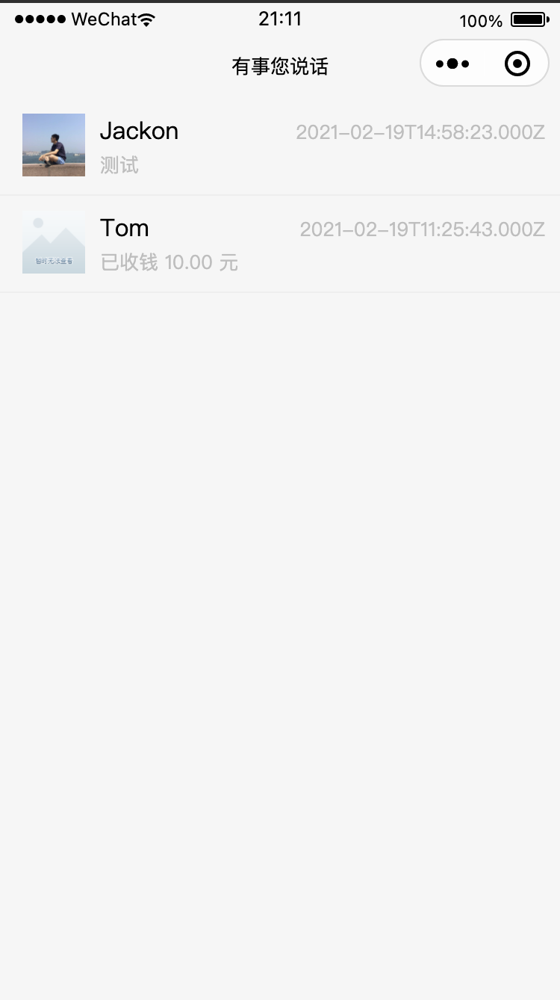
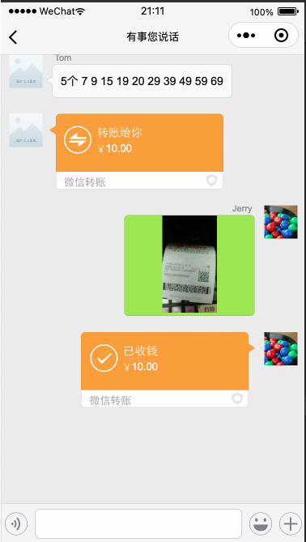
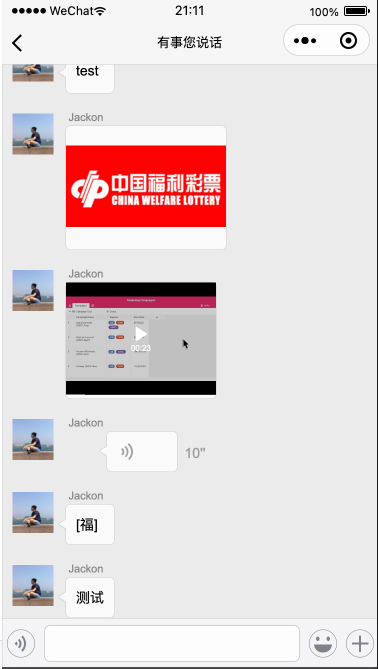

# chatbot v0.1

这是一个只能看消息，不能发消息的 chatbot。

界面模仿微信，支持 text / Image / Video / 红包 / 转账 等常见微信消息类型的查看。

如果你有一个微信个人号，或者公众号的 chatbot，可以把消息导出来，用这个工具查看。

下一版本，将增加发消息 & 自动回复的功能。

## 代码

- 小程序代码，[projects/miniapp-chatbot](../../../projects/miniapp-chatbot)
- 后端代码，[projects/chatbot-server](../../../projects/chatbot-server)

## 数据结构

分 2 类：

- [chat-data](../../../projects/chatbot-server/resourses/chat-data-example)：聊天的 meta data & text。每一条消息，一个 json 文件保存，易于 backup 到 s3。在后端数据预处理模块 [chatbot-server/message/data_manager.py](../../../projects/chatbot-server/message/data_manager.py) 里 merge 成易于 query 和前端使用的格式，通过 API 返回。
- [media](../../../projects/chatbot-server/media)：图片、视频、音频、头像等。

## 界面预览

chat-list.png

chat-transfer-demo.png

chat-video-demo.png

