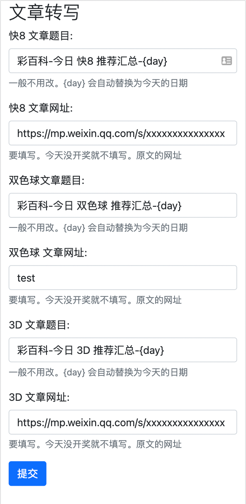

# 自动写文章的编辑器 -- v0.2 介绍

## 主要页面 1 个

填一下别人的文章地址，点提交。后台自动下载其中的图片，上传到自己的公众号，并生成新的文章。

生成的文章，长这样：[彩百科-今日 快8 推荐汇总-2021-11-26](https://mp.weixin.qq.com/s/_3_I5CSoDcLe5v8dLIs0dg)

原本每天 20 分钟手动做的事情，现在不到 5 分钟。
