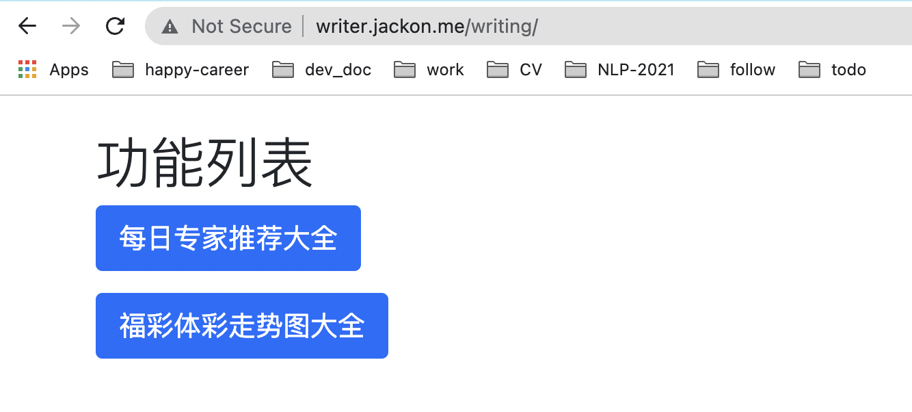
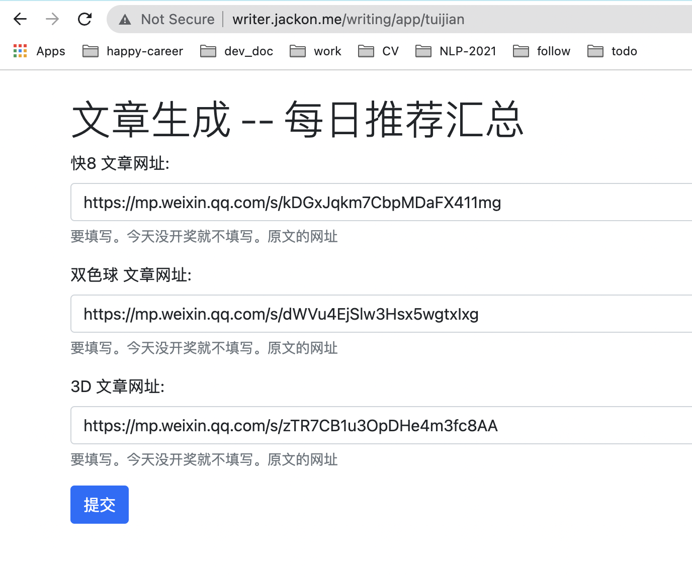
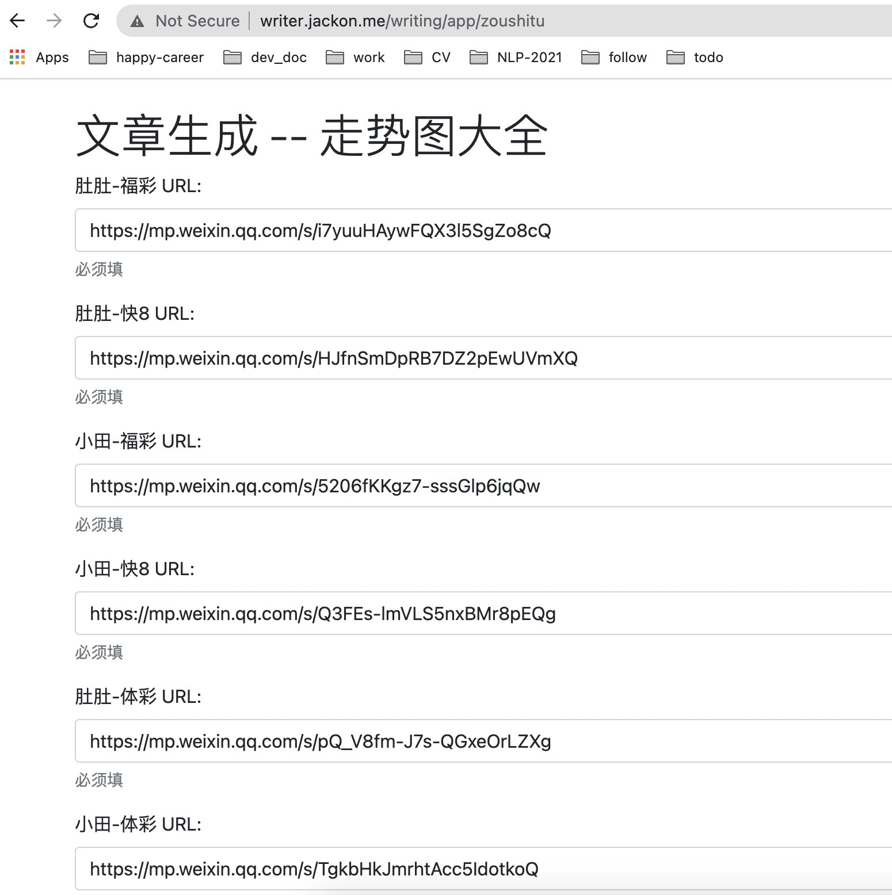
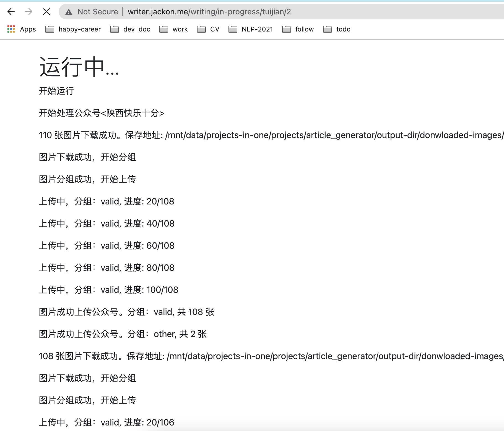
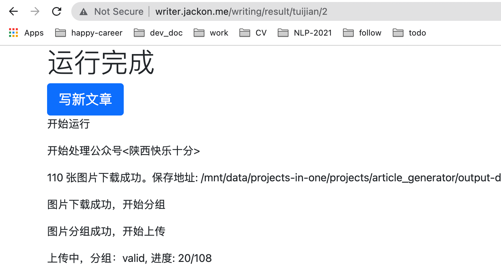

# 自动写文章的编辑器 -- v0.2 介绍

## 主要页面 4 个

page1: 功能选择页面。支持 2 个功能。一个功能，对应一次推送，可以是多篇文章。

page2: 参数输入。每个功能的页面都差不多，只是预置的参数不一样

page3: 进展通知。任务是异步执行的了，有 progress 页面，能看到进展和 log

page4：结果通知。当前做的和 progress 页面差不多。后面要迭代，改成能预览下载的图片、上传的文章效果等。点击“写新文章”，返回 page 2

## 通用的处理流程 Pipeline: ImageGroupPipe

源码位置: [image_group_pipe.py](https://github.com/JackonYang/projects-in-one/blob/da2fe0aae3bebcbca1a76f3bfd59a31202cbacdc/projects/article_generator/pipelines/image_group_pipe.py)

1. 格式化用户参数，把用户友好的参数，翻译成下游友好的结构，并填入关键的默认参数，比如 pipeline 名字，图片过滤算法等。
2. 下载图片，可以把多篇原始文章的图片，下载到一个目录下，合并为 1 篇文章
3. 图片分组。分组算法，当前有 2 套，支持每个功能的每一篇文章配置不同算法。通过图片分组算法，可以过滤掉不想要的图片，比如别的引导关注图片。
4. 图片上传。
5. 图片分组排序、组内图片排序，然后按顺序渲染文章。
6. 文章上传，流程完成。

## 回归测试

article_generator 项目，100% 代码行的测试覆盖率，100% 的对外 API 接口覆盖率
